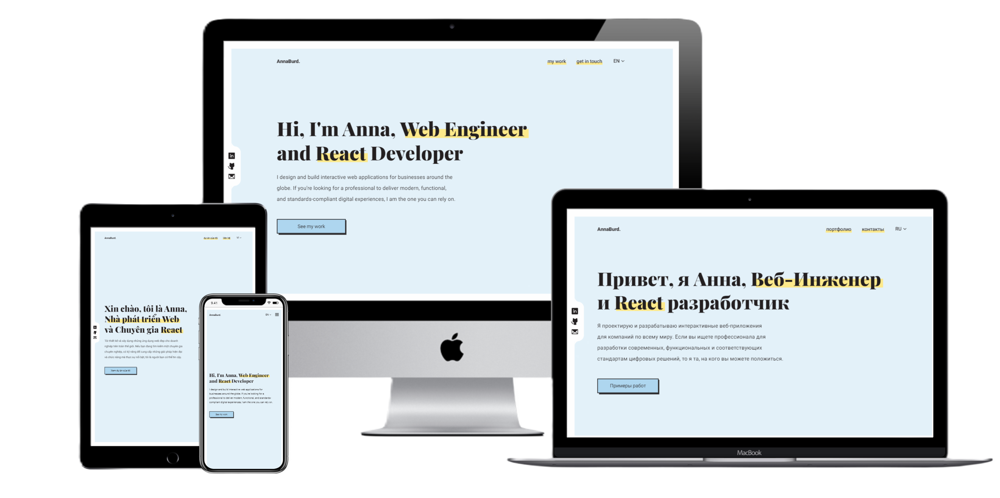

# [Web Portfolio - AnnaBurd ][url]

> A simple and user-friendly web portfolio designed for multilingual web developers, suitable for beginners or freelancers. Developed with Next.js, TypeScript, and Tailwind CSS, this project focuses on showcasing your projects in a structured and accurate manner.

[url]: https://annaburd.me/ "Anna's portfolio"

In the ever-evolving digital landscape, **personal branding** is not merely a choice - it's a necessity, especially in the fiercely competitive job market for aspiring developers. A **standout portfolio is a contemporary requirement nowadays** - without one, the journey to securing your first job can be an uphill battle.

Fortunately, there's no shortage of open-source portfolios for inspiration. You can explore curated lists such as:

1. [emmabostian/developer-portfolios](https://github.com/emmabostian/developer-portfolios)
   > A compilation of developer portfolios for your creative inspiration.
2. [Evavic44/portfolio-ideas](https://github.com/Evavic44/portfolio-ideas)
   > A curation of awesome portfolio website ideas for developers and designers to draw inspiration from.
3. [Renovamen/playground-macos](https://github.com/Renovamen/playground-macos)
   > An innovative portfolio website that simulates the macOS GUI.

However, most existing portfolios are written exclusively in English (or another single language), leaving a gap for those who communicate in multiple languages.

This project addresses that gap, concentrating on **multilingual beginner developers and freelancers**, offering robust internationalization support (with i18n). On the downside, it multiplies the task of content writing, necessitating a copy for each language you know.

[**Visit Live Site**][url]

## Key Features

- i18n support
- Mobile-first responsive design

## Designed with and Built with

For a comprehensive view of all dependencies, including exact versions, feel free to explore the details in the [package.json](https://github.com/AnnaBurd/web-portfolio/blob/main/package.json) file.

| Name                                                                                                                       | Usage                                                 |
| -------------------------------------------------------------------------------------------------------------------------- | ----------------------------------------------------- |
|         | A superset of JavaScript with static typing.          |
|                        | JavaScript library for building user interfaces.      |
|                   | React framework for building web applications.        |
|                  | An internationalization framework for JavaScript.     |
|     | Set of completely unstyled UI components.             |
|                  | Lightweight markup language for formatting text.      |
|                        | Collaborative interface design tool.                  |
|  | Utility-first CSS framework for rapid UI development. |

## Getting Started

| Command           | Action                                       |
| :---------------- | :------------------------------------------- |
| `npm install`     | Installs dependencies                        |
| `npm run dev`     | Starts local dev server at `localhost:3000`  |
| `npm run build`   | Build your production site to `./.next/`     |
| `npm run preview` | Preview your build locally, before deploying |

Open [http://localhost:3000](http://localhost:3000) with your browser to see the result.

## Project Structure

The project uses the `NextJS app router` and file-based routing.

## Deployment

The project can be deployed to Vercel/Netlify hosting (tested on Netlify).

## 👀 Want to contribute?

1. Fork project (<https://github.com/AnnaBurd/web-portfolio/fork>)
2. Create your feature branch (`git checkout -b feature/fooBar`)
3. Commit your changes (`git commit -am 'Add some fooBar'`)
4. Push to the branch (`git push origin feature/fooBar`)
5. Create a new Pull Request

[Discuss Issues](https://www.linkedin.com/in/anna-burdanova-b91453218/)
